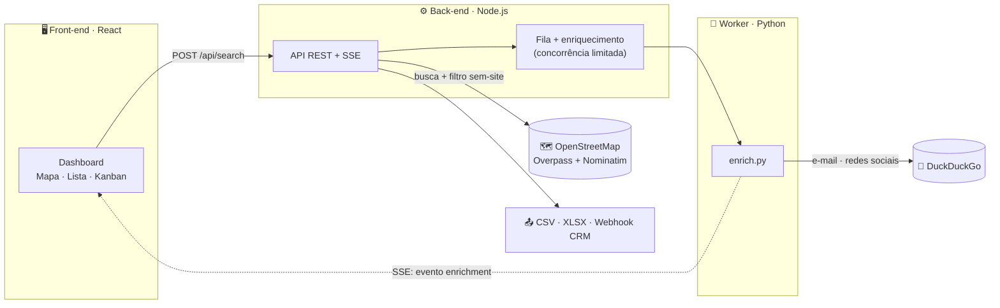

<div align="center">

# 🎯 Captação

### Prospecção B2B inteligente — encontre negócios **sem site**, enriqueça os contatos e gerencie tudo num funil visual.

[](https://nodejs.org)
[](https://python.org)
[](https://react.dev)
[](https://leafletjs.com)
[](#-100-gratuito)
[](#-roadmap)

</div>

---

Um SaaS estilo **busca imobiliária**: de um lado um mapa interativo, do outro a lista de leads. Você define **nicho + cidade + raio**, e o sistema encontra os estabelecimentos comerciais da região que **não têm website cadastrado** — exatamente o público que mais precisa de presença digital. Para cada lead, um worker busca **e-mail, Instagram, Facebook e LinkedIn** na web, em tempo real.

> 💸 **100% gratuito, sem chaves de API e sem cartão de crédito.** Os dados vêm do **OpenStreetMap** e o enriquecimento do **DuckDuckGo**. Zero cobrança.

---

## ✨ Destaques

- 🗺️ **Mapa interativo** com pinos coloridos por status (Leaflet + tiles OpenStreetMap)
- 🔍 **Filtro "sem website" nativo** — descarta automaticamente quem já tem site
- 🧩 **Enriquecimento sob demanda** — e-mail, Instagram, Facebook e LinkedIn via busca cruzada
- ⚡ **Tempo real (SSE)** — os contatos pingam na tela conforme são encontrados, sem travar
- 🗂️ **Funil Kanban** — arraste leads entre `Novo · Qualificado · Contatado · Ganho · Descartado`
- 🏙️ **Autocomplete de cidade** com geocoding gratuito (Nominatim)
- 📤 **Exportação CSV / Excel** + **webhook** para integrar com seu CRM

---

## 🧱 Stack

| Camada | Tecnologia |
|---|---|
| **Front-end** | React + Vite + react-leaflet |
| **Back-end / API** | Node.js + Express (SSE) |
| **Worker de extração** | Python (httpx, asyncio) |
| **Dados de negócios** | OpenStreetMap — Overpass API |
| **Geocoding** | OpenStreetMap — Nominatim |
| **Enriquecimento** | DuckDuckGo (busca cruzada) |
| **Exportação** | exceljs (CSV / XLSX) |

---

## 🏗️ Arquitetura



**Fluxo em duas fases:** a busca (`POST /api/search`) é **síncrona e rápida** — devolve os negócios sem site e os pinos aparecem na hora. O enriquecimento roda **em segundo plano** e cada lead pronto é empurrado para a tela via **Server-Sent Events**, sem recarregar nada.

---

## 🚀 Rodando localmente

**Pré-requisitos:** Node.js 18+, Python 3.10+

```bash
# 1) Worker Python (uma vez)
pip install -r workers/requirements.txt

# 2) API  →  http://localhost:3001
cd server && npm install && npm run dev

# 3) Front  →  http://localhost:5173
cd web && npm install && npm run dev
```

Abra **http://localhost:5173**, digite um nicho (ex: _"salão de estética"_), escolha a cidade/raio e clique em **Buscar leads sem site**. Alterne entre **🗺️ Mapa** e **🗂️ Kanban** na barra lateral.

---

## ⚙️ Configuração (variáveis de ambiente, todas opcionais)

| Variável | Padrão | Função |
|---|---|---|
| `DATA_PROVIDER` | `osm` | `mock` usa dados fictícios offline (demo sem rede) |
| `ENRICH_PROVIDER` | `python` | `mock` gera contatos fictícios sem chamar o DuckDuckGo |
| `ENRICH_CONCURRENCY` | `2` | leads enriquecidos em paralelo (educado com o DDG) |
| `ENRICH_BACKGROUND` | `true` | `false` = só enriquece quando o usuário clica no lead |
| `PYTHON_BIN` | `py` / `python3` | binário do Python para os workers |

---

## 🔌 Principais endpoints

| Método | Rota | Descrição |
|---|---|---|
| `POST` | `/api/search` | Busca + filtro "sem site"; abre uma sessão |
| `GET` | `/api/search/:id/stream` | Stream SSE do enriquecimento |
| `GET` | `/api/geocode?q=` | Autocomplete de cidade (Nominatim) |
| `POST` | `/api/search/:id/leads/:leadId/prioritize` | Enriquece um lead sob demanda |
| `PATCH` | `/api/search/:id/leads/:leadId` | Move o lead de estágio no Kanban |
| `GET` | `/api/search/:id/export?format=csv\|xlsx` | Baixa a planilha de leads |
| `POST` | `/api/search/:id/webhook` | Envia os leads (JSON) para um CRM |

---

## ⚠️ Limites dos serviços gratuitos

- **Overpass** limita ~2 consultas simultâneas por IP e enfileira a resposta sob carga (alguns segundos). Há **cache de 10 min** por busca. Se vier "Overpass ocupado", espere um pouco ou reduza o raio.
- **DuckDuckGo** pode limitar buscas em rajada — por isso a concorrência é baixa e há _jitter_ entre as chamadas. Em escala, troque por **Brave Search API** (free tier) ou Serper.dev.
- **Nominatim** permite no máx. 1 req/seg — o back-end serializa as chamadas e há debounce no front.
- **Cobertura do OSM** varia por região/nicho e **não traz avaliações**. Nichos bem mapeados (restaurantes, beleza, clínicas, dentistas) rendem mais resultados.

---

## 🗺️ Roadmap

- [x] Busca de negócios sem site (Overpass) + filtro
- [x] Enriquecimento de contatos (Python + DuckDuckGo)
- [x] Tempo real via SSE + mapa Leaflet
- [x] Autocomplete de cidade (Nominatim)
- [x] Exportação CSV / Excel + webhook
- [x] Funil Kanban (drag-and-drop)
- [ ] **Persistência em PostgreSQL** (hoje as sessões vivem em memória)
- [ ] Autenticação e multi-tenant
- [ ] Fila distribuída (BullMQ/Redis) para múltiplos workers
- [ ] Proxies rotativos para enriquecimento em escala

---

## 📌 Observações

- Projeto em estágio **MVP** — as sessões (leads, estágios) ficam em memória e somem ao reiniciar o servidor. Persistência em banco é o próximo passo.
- Tiles do OSM são gratuitos mas têm política de uso justo; em produção use um provedor de tiles (MapTiler) ou self-host.
- Coleta de contatos para prospecção: registre a origem do dado (campo `source`), ofereça _opt-out_ e trate apenas o necessário (**LGPD**).

---

<div align="center">
<sub>Feito com ☕ e dados abertos do OpenStreetMap · contribuições ODbL</sub>
</div>
